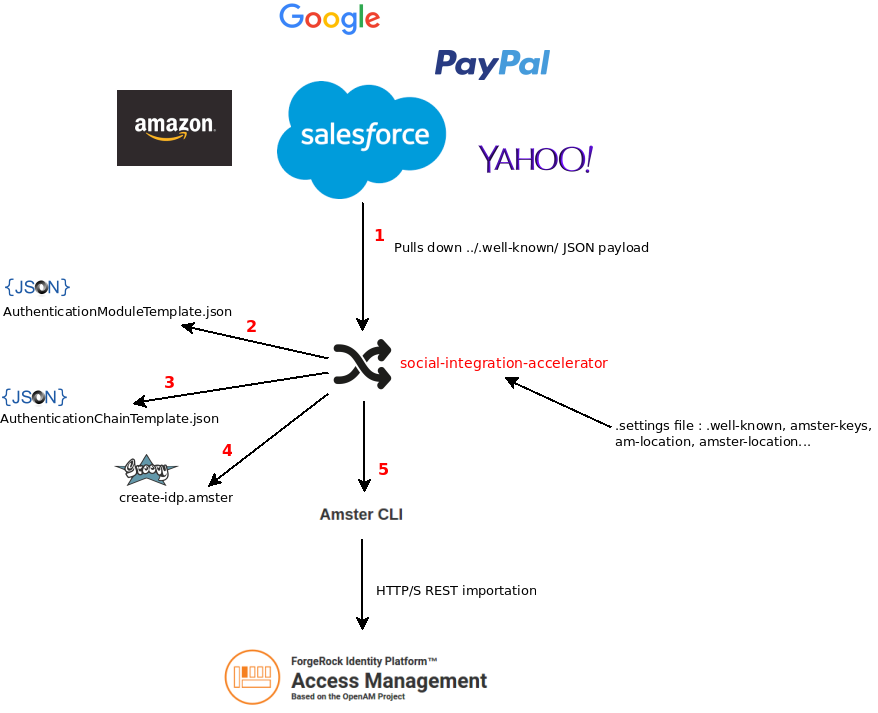
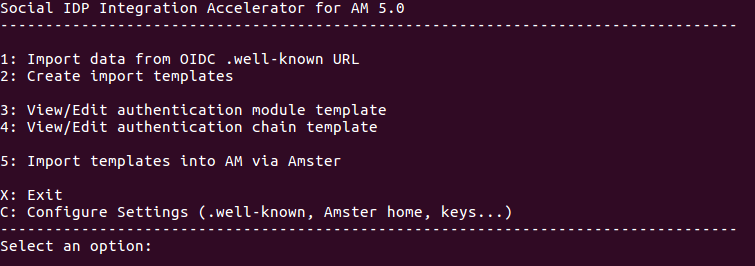
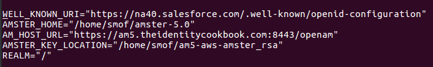
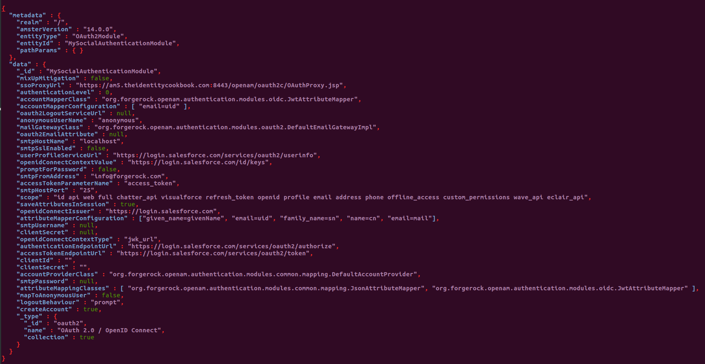
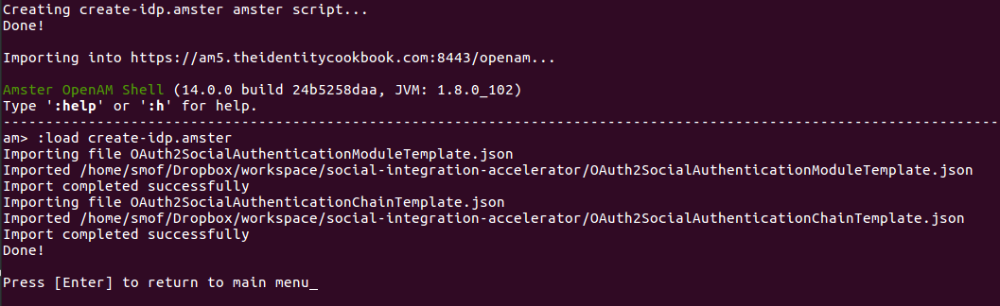

<b>social-integration-accelerator</b>
 
 
Scripted utility to accelerate the integration of 3rd party OAuth2/OIDC compliant identity providers into ForgeRock Access Management 5.0 
 
 

 
 
<b>Running: </b>
 
1 - clone/download, chmod +x on social-integration-accelerator if necessary  
2 - from bash, run ./social-integration-accelerator  
  
3 - select option C, and edit any settings  
  
4 - select option 1, to pull down .well-known JSON payload  
5 - select option 2, to create the necessary templates  
6 - select option 3/4, to view/edit the templates, adding in any client Id's or secrets and checking any mappings   
  
7 - select option 5 to import into AM via amster
  
 
 
<b>Limitations</b> 
1 - Need to add client Id and secrets manually and check mappings are accurate  
2 - If the login logo is required on the AM first screen, need to manually export the SocialAuthentication.json from AM using amster and upload necessary logo  
3 - If IDP doesn't support .well-known URL download, have to create templates and manually add in URL's  
 
 
Use as-is.  Note this utility is a community contribution only and is not supported by ForgeRock.
 
See LICENSE for further details.
 

